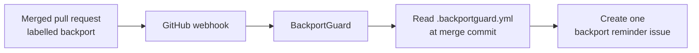

# BackportGuard

[](https://github.com/devggchel/backportguard/actions/workflows/tests.yml)
[](LICENSE)
[](pyproject.toml)

**Keep fixes moving — without moving code for you.**

BackportGuard is a free, open-source GitHub webhook service. When a pull request is merged with the configured `backport` label, it reads a small policy file from that merge commit and creates one clear issue reminding the team which maintained branches need review.

[Project site](https://backportguard.pages.dev/) · [Installation](#production) · [Security](SECURITY.md) · [Contributing](CONTRIBUTING.md)

## What it does



1. GitHub sends a signed `pull_request` delivery.
2. BackportGuard accepts only merged pull requests whose labels meet the policy.
3. It reads the configured branch list from the repository at the merge commit.
4. It opens a reminder issue. Your team decides whether and how to backport.

**It never cherry-picks, clones, executes, or automatically applies third-party code.**

## Configure a repository

Add `.backportguard.yml` to every repository you want to monitor:

```yaml
branches:
  - release/1.0
  - release/0.9
labels:
  required:
    - backport
```

The delivery is considered only when all labels in `labels.required` are present. Branch names are displayed in the issue exactly as declared; they are not passed to a shell or Git command.

## Run locally

```bash
python3 -m venv .venv
.venv/bin/pip install -r requirements-dev.txt
WEBHOOK_SECRET=development-only DATABASE_PATH=/tmp/backportguard.sqlite3 \
  .venv/bin/uvicorn backportguard.main:app --host 127.0.0.1 --port 8765
```

Then check `http://127.0.0.1:8765/health` and run:

```bash
.venv/bin/pytest -q
```

## Production

BackportGuard is designed to stay small and isolated:

- FastAPI listens only on `127.0.0.1`.
- SQLite records delivery IDs so retries do not create duplicate issues.
- The supplied systemd unit limits memory to 512 MiB, sustained CPU to half a core, and tasks to 64.
- A Cloudflare Tunnel provides outbound-only publication; do not expose SSH or the application port.

See [deployment notes](docs/operations.md) and the [GitHub App guide](docs/github-app.md). Keep all credentials outside Git in `/etc/backportguard/backportguard.env` (mode `0600`).

## Trust boundaries

| Boundary | BackportGuard behaviour |
| --- | --- |
| GitHub delivery | HMAC-SHA256 signature required for `pull_request` events |
| Request body | 1 MiB maximum; malformed JSON is rejected |
| Repository policy | YAML is parsed safely and treated only as declarative data |
| GitHub API | Uses a least-privilege GitHub App installation token |
| Replay | SQLite claims each delivery before an issue can be created |

Read the full [architecture](docs/architecture.md), [security policy](SECURITY.md), and [privacy note](PRIVACY.md).

## Roadmap

- [#1](https://github.com/devggchel/backportguard/issues/1) GitHub App manifest improvements
- [#2](https://github.com/devggchel/backportguard/issues/2) Configurable issue templates
- [#3](https://github.com/devggchel/backportguard/issues/3) Webhook delivery troubleshooting

## Contributing and licence

Small, focused contributions are welcome. Start with [CONTRIBUTING.md](CONTRIBUTING.md), follow the [Code of Conduct](CODE_OF_CONDUCT.md), and never include credentials, databases, or virtual environments in a pull request.

Licensed under [Apache-2.0](LICENSE).
